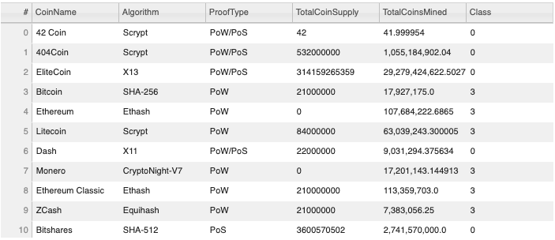
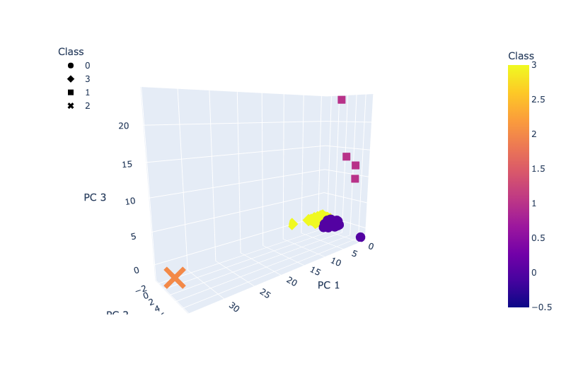
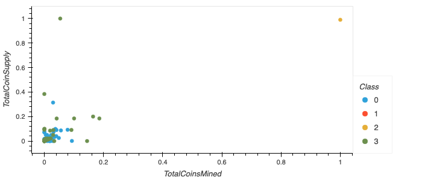
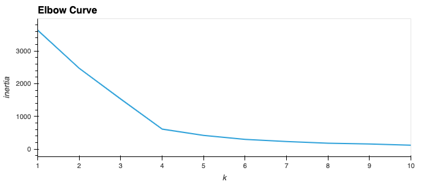

# Cryptocurrencies

## Objective 
For this project, I utilized Unsupervised Machine Learning to create an analysis for cryptocurrency data.  My report shows what cryptocurrencies are on the trading market and how they could be grouped to create a classification system.

Unsupervised Machine Learning is widely used when we are dealing with unlabelled data.  It allows the model to work on its own to discover patterns.  The Unsupervised Learning Algorithm used for this project was a form of clustering called K-means.  

The K-means algorithm groups the data into k clusters, where belonging to a cluster is based on some similarity or distance measure to a centroid.  A centroid represents the center of the cluster.

### Tasks
- Preprocessing the Data for PCA
- Reducing Data Dimensions Using PCA
- Clustering Cryptocurrencies Using K-means
- Visualizing Cryptocurrencies Results

## Resources
### Tools/Languages
- Jupyter Notebook 6.4.5
- Visual Studio Code 1.66.1 
- Pandas 1.3.4
- Scikit-learn 1.0.2
- hvPlot 0.7.3
- Plotly

 ### Data
 - cryptocurrency data (https://min-api.cryptocompare.com/data/all/coinlist)
 - unsupervised machine learning (https://www.guru99.com/unsupervised-machine-learning.html)

 ## Results

 ### Table of Tradable Cryptocurrencies

### 3D Scatter with PCA Data and the Cluster

### Plot of Scaled Data

### Elbow Curve

